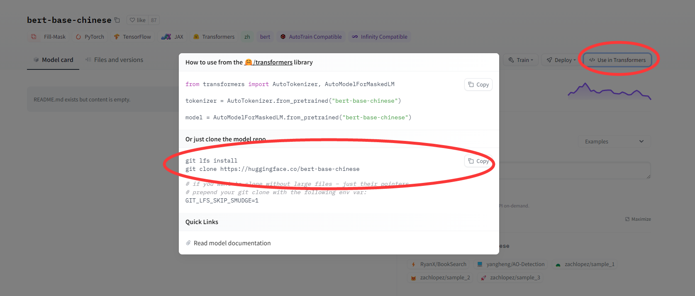

> 2022.6.18 综评4.9,寄,配服务器环境+炼丹花了挺多精力的,不如直接分词+统计学方法,这下小丑了捏🤡

# HDU-NLP-Task
杭电计算机自然语言处理课程作业

实现了三个NLP经典任务：
1. 垃圾邮件分类          (BERT)
2. 影评分类             (RoBERTa)
3. 根据关键词生成商品描述  (GPT-2)

**模型需要到 [hugging face](https://huggingface.co/) 下载对应的pre-trained model，
由于第二个任务数据集小，而且实际做出效果较差，没有存档**

fine-tune后的模型可以直接用在对应的数据集上

[未做微调的bert-base-chinese](https://huggingface.co/bert-base-chinese)

[未做微调的chinese-roberta-wwm-ext](https://huggingface.co/hfl/chinese-roberta-wwm-ext)

[未做微调的gpt2-chinese-cluecorpussmall](https://huggingface.co/uer/gpt2-chinese-cluecorpussmall)

**有条件的建议自己做一下fine-tune体验坐lao的感觉(×)**

[bert做5个epoch的fine-tune后的model](https://huggingface.co/cocoshe/bert-base-chinese-finetune-5-trash-email)

[gpt2做5个epoch的fine-tune后的model](https://huggingface.co/cocoshe/gpt2-chinese-gen-ads-by-keywords)


> 任务均基于 hugging face 实现，其他任务可自行探索，
> 虽然官方提供的Trainer API非常强大，类似于pytorch lighting，
> 但是个人还是喜欢用pytorch原生的train loop (总感觉.fit .predict这样sklearn样式的封装太厉害，心里不踏实).
> 但是Trainer和pl方便是真的方便🤡


## 拉取模型

1. 将model clone到工作目录下


> git lfs问题：
> 
> **由于模型参数较大，所以是用git lfs存的，clone下来可能会是几行字符串，需要`git lfs pull`拉取**

```shell
sudo apt install git-lfs
git lfs install
cd 模型目录
git lfs pull
```

2. 代码中的`from_pretrained`路径要指向模型的文件夹
