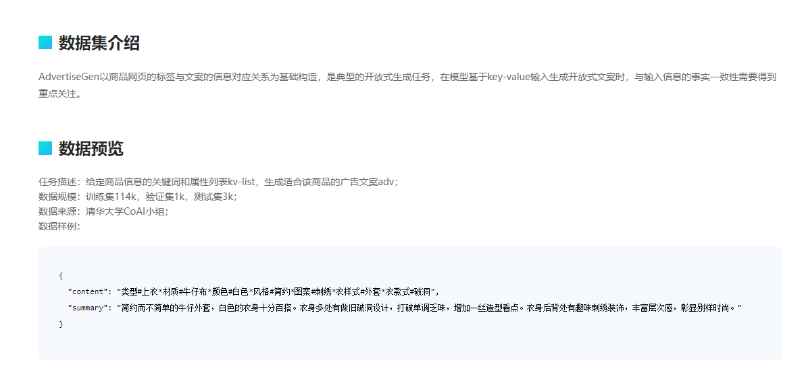
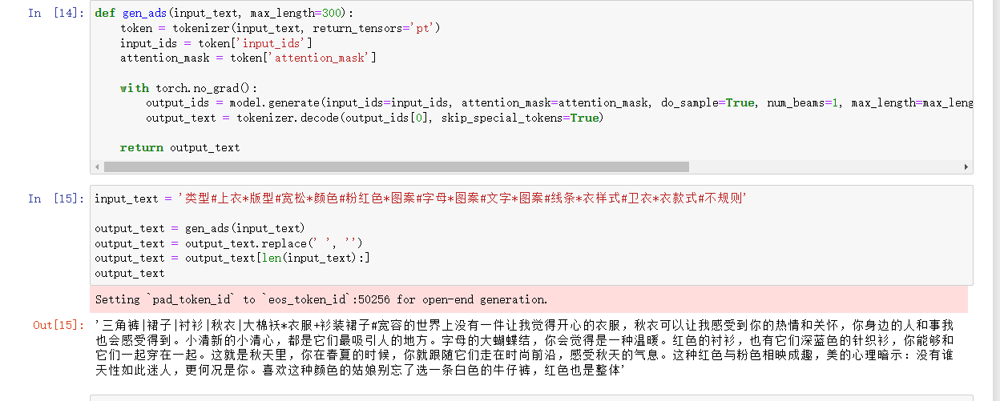
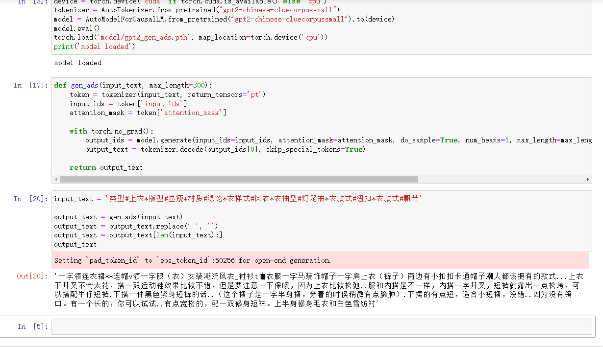

# 文本生成

这是一个较大的概念，以下一些任务都可以**广义算作文本生成**：
1. 🚀Text Generation
2. ⭐Summarization
3. 😷Fill-Mask
4. 🌱Seq2Seq(Sequence to Sequence)
5. ❓Question Answering
6. ⏭NSP(Next Sentence Prediction)
7. 📜Text to Text
8. ...
> 以上有一些概念会有所重合，可以自己查阅相关资料理解一下，不必细究

本实验跑了两个Pre-trained model, 一个是[GPT2](https://d4mucfpksywv.cloudfront.net/better-language-models/language_models_are_unsupervised_multitask_learners.pdf) ,一个是[BART](https://arxiv.org/pdf/1910.13461.pdf).

## 实验
实验数据：[千言—AdvertiseGen广告文案生成数据集](https://www.luge.ai/#/luge/dataDetail?id=9)


### 数据集分析

按照题目要求，要根据一些关键词，生成广告文案。很容易就能看出，这是一个开放式的文本生成任务。
在选模型的时候，最重要的是要知道模型在预训练阶段做的是什么任务，大概常见的就是分为两类：
1. 一类是以BERT为代表的"双向Transformer"，它在预训练阶段做的是所谓的"完形填空"(Fill-Mask)和"预测下一句"(NSP)的任务。
2. 一类是以GPT为代表的"单向Transformer"，它在预训练阶段做的是一个逻辑推理任务，通过句子左侧的词语，预测右侧的词语。
> Transformer 是一种纯注意力机制搭建的架构，完全摈弃了原先的RNN，相关内容可以结合视频或者相关博客读一读它的paper:《Attention is all you need》 了解，这里不过多赘述

所以BERT在fine-tuning的时候，适合做一些完形填空任务和句子语义相关任务(Fill-Mask, Sequence Classification...)，而GPT在fine-tuning的时候，适合做一些逻辑推理任务(QA, Text Generation...)。
当然以上只是说"适合"，并不是不能，而是可能效果不好。

**两者最大区别就是BERT认为：你推理一个<MASK>是什么，可以根据它的左边和右边来一起判断；而GPT认为这是不合理的，所以它规定推理一个<MASK>必须把它右边的单词遮掉。**


于是我一开始比较纠结，是用完全的开放式文本生成，还是利用seq2seq的方法来做这个事情呢？于是我就考虑先用GPT2来做，看看效果如何。

```python
batch_size = 16
epoch = 5
```
嫖的机子比较差(1c8g)，bs往上调就爆内存了，所以这里用16个batch size。
一般来说做fine-tuning的epoch在5左右差不多了，大概炼了5个小时。

测了一下，非常遗憾，发现炼废了(假的，后面发现是search的算法不合适)

接着我就把它当成一个Summarization任务(毕竟数据集的label的key都叫做"summary"了，疯狂暗示)

于是选了BART做这个任务，因为考虑到它在Pre-train阶段有做过seq2seq的相关任务。但是这就会比较奇怪，因为一般来说都是做"摘要"，
但是这里的任务其实是要求做一个"扩写"，两个互逆的过程或许会产生一些冲突？也就是说Pre-train的过程可能帮了倒忙？

```python
batch_size = 64
epoch = 5
```

同样跑了5个epoch，换了个好一些的机子(4c32g)，大概跑了一个小时十五分钟，最后测试的时候发现了一个重大问题：
`generate()`需要考虑多种search算法，不同的算法可能会有非常大的影响！

所以我换了几个不同的search方式测试，发现BART是炼废了(偶然性或者是真的废了？又或者是"摘要"和"缩写"的矛盾引起的效果差？或者是调参优化？)

但是重新测了一下GPT2，发现效果还算是合格的:






